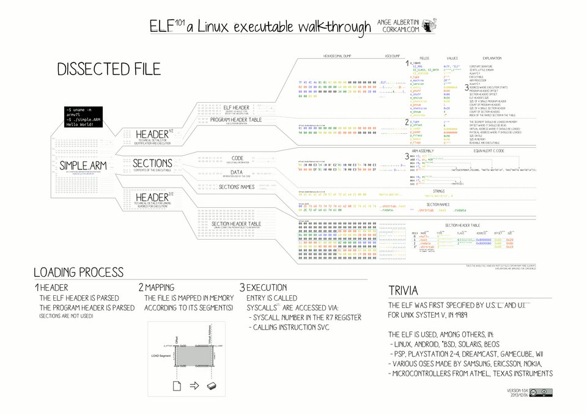

# woody-woodpacker

This project is about coding a simple packer

## ELF files

## ELF Headers and Program Headers

- [Program Headers](https://docs.oracle.com/cd/E19683-01/816-1386/6m7qcoblk/index.html#chapter6-69880)

## How to

- [X] Unpack binary into memory using nmap
- [X] Parse Elf Headers to recover Program Headers and executable segment
- [X] Yoink `.text` and check integrity
- [ ] Write simple stub in ASM and get its size
- [ ] Allocate (nmap result + stub_size) so we can start creating `woody`
- [ ] In that allocated buffer, insert the stub inplace of PT_LOAD with X
- [ ] Update and pad memory map + update entrypoint

## Reading

- [The OG packer for malware](https://aeb.win.tue.nl/linux/hh/virus/unix-viruses.txt)
- [Virology blog regarding malware](https://cryptohub.nl/zines/vxheavens/lib/-index=UN&lang=en.htm)
- [Some assembly background and theory](https://github.com/mschwartz/assembly-tutorial)
- [x86-64 Registers](https://math.hws.edu/eck/cs220/f22/registers.html)

## ASM Instruction Cheatsheet

### Making a syscall

[List of syscalls for Linux x86_64](https://syscalls.w3challs.com/?arch=x86_64) and where to store their parameters

| Register name | Argument number |
| ------------- | --------------- |
| rdi           | 1st argument    |
| rsi           | 2nd argument    |
| rdx           | 3rd argument    |
| r10           | 4thargument     |
| r8            | 5th argument    |
| r9            | 6th argument    |

## cipher

Voici les avantages de RC4 en dehors de la simplicité d'implémentation :

1. Rapidité d'exécution

RC4 est l'un des chiffrements les plus rapides qui existent, car il ne travaille que sur des octets individuels avec des opérations très basiques (échanges, additions modulo 256, XOR) — pas de calculs mathématiques lourds comme dans RSA, ni de rounds complexes comme dans AES. Pour ton stub qui s'exécute à chaque lancement du programme, ça signifie un déchiffrement quasi instantané, même sur une machine peu puissante.

2. Pas de contrainte de taille de bloc

RC4 est un chiffrement par flux, pas par bloc. Il traite les données octet par octet, dans n'importe quelle longueur, sans avoir besoin d'un padding (remplissage) pour arriver à un multiple de taille de bloc (comme le seraient AES avec ses blocs de 16 octets, ou XTEA avec ses blocs de 8 octets).

Pourquoi c'est utile pour toi : la taille de ta section .text n'a aucune raison d'être un multiple propre de 8 ou 16 octets. Avec un chiffrement par bloc, tu devrais gérer le cas où la taille ne "tombe pas juste" (ajouter du padding, puis le retirer proprement après déchiffrement — source d'erreurs). Avec RC4, tu chiffres exactement le nombre d'octets que tu as, ni plus ni moins.

3. Empreinte mémoire minimale

L'état interne de RC4, c'est juste le fameux tableau de 256 cases (256 octets) plus deux ou trois compteurs. C'est très léger comparé à d'autres algorithmes qui nécessitent des tables de substitution plus grosses (S-boxes d'AES) ou des structures de données plus complexes.

4. Aucune dépendance à des bibliothèques externes

Contrairement à AES où l'implémentation "propre" et sécurisée est réputée délicate à écrire soi-même (vulnérable aux attaques par canal auxiliaire si mal implémenté), RC4 est simple à écrire correctement à la main sans introduire de failles d'implémentation graves — ce qui compte quand tu codes tout en C pur sans lib crypto.

5. Cohérence avec ce qui se fait réellement dans le monde du malware

Comme on l'a vu dans les recherches précédentes, RC4 (ou des variantes maison très proches) est historiquement l'un des chiffrements les plus utilisés par les vrais crypters et malwares. Choisir RC4 pour ton projet, ce n'est donc pas juste "la solution facile" — c'est aussi réaliste et représentatif de ce que font les outils de ce type dans la pratique, ce qui a une vraie valeur si le but est de comprendre comment fonctionnent les packers "en vrai".

6. Flexibilité de la taille de clé

RC4 accepte des clés de longueur variable (de 1 à 256 octets) sans changer l'algorithme lui-même — contrairement à AES où la taille de clé (128/192/256 bits) change la structure interne (nombre de rounds, etc.). Ça te donne une liberté simple si tu veux expérimenter avec différentes longueurs de clé.

En résumé : au-delà d'être facile à coder, RC4 t'évite les problèmes de padding/alignement liés aux chiffrements par bloc, reste très performant, et correspond à un choix réaliste par rapport aux pratiques du monde du malware.

### ressources

- [RC4 Encryption Deep Dive: Architecture, Attacks, Cryptanalysis, and Secure Alternatives ](https://www.qcecuring.com/blog/what-is-rc4)
- Why using /dev/urandom isn't a bad choice to get a random key : [Myths about /dev/urandom](https://www.thomas-huehn.com/myths-about-urandom/)
- [RC4 Wiki](https://en.wikipedia.org/wiki/RC4)