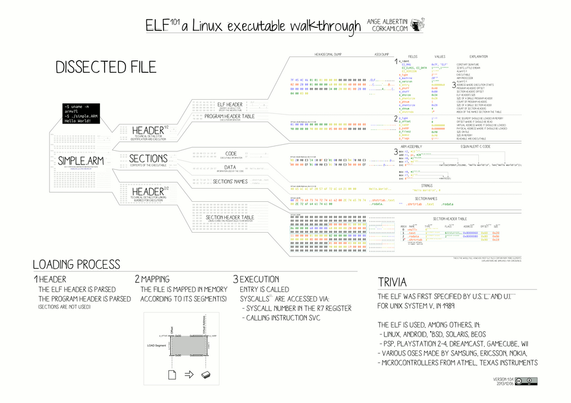

# woody-woodpacker

A naive ELF64 packer built for the 42 school curriculum. woody-woodpacker takes a statically linked ELF64 executable, encrypts its `.text` segment, and injects a small decryption stub that runs at program start, decrypts the code in place, and hands control back to the original entry point.

## How it works

1. **Parse the target ELF**. Read the ELF header, program headers, and locate the executable PT_LOAD segment (the one containing `.text`).
2. **Encrypt `.text`**. The executable segment's bytes are encrypted in place using a stream cipher (RC4) with a randomly generated key.
3. **Write and inject a stub**. A small, self-contained x86-64 assembly stub is written into the binary (naive code cave implementation). The stub:
	- calls mprotect to make the encrypted segment writable,
	- runs RC4 key-scheduling and decrypts `.text` in place,
	- jumps to the original entry point.  
4. **Redirect e_entry.** The ELF header's entry point is rewritten to point at the stub. The stub itself stores the original entry point and jumps to it once decryption is complete.

## Usage

```bash
	./woody_woodpacker <path-to-executable>
```

On success, a packed binary named woody is created in the current directory.

## Scope and limitations

### Dynamically linked binaries

woody-woodpacker refuses to pack any binary containing a `PT_INTERP` segment (i.e. any dynamically linked executable). This is a deliberate design decision, not a missing feature — see below.

### Why dynamic linking is unsupported

During testing, packing certain dynamically linked binaries (e.g. gdb, rsync) produced binaries that crashed with a SIGSEGV before the stub ever ran, affecting a small but real fraction of test cases (>1% of the test corpus).

The root cause in every case was the same: the dynamic linker (`ld.so`) is invoked by the kernel before the packed binary's own entry point runs, whenever a `PT_INTERP` segment is present. `ld.so` performs relocation processing as part of its own startup — entirely outside the packed binary's control — and this processing can require reading from or executing code inside `.text`, which at that point is still ciphertext. The stub's entry-point redirection trick offers no protection here, because the stub never gets a chance to run before `ld.so` does.

Two distinct relocation mechanisms were identified as concretely triggering this:

- **Symbol interposition**. When a binary statically links a language runtime (e.g. libstdc++) and does not hide the runtime's symbols (e.g. operator new / operator delete), those symbols become globally visible exports of the packed binary itself. If a needed shared library independently references a symbol with the same name, the dynamic linker's symbol resolution rules give the main executable priority — so the library's call gets resolved against the packed binary's own (still-encrypted) definition. Under BIND_NOW, this resolution happens eagerly, before the stub runs, and the resolved address points into ciphertext.
- **IRELATIVE relocations**. R_X86_64_IRELATIVE relocations do not store a fixed address — they store the address of a resolver function, which `ld.so` calls directly during relocation processing to determine the real target address (used for glibc's IFUNC/CPU-feature-dispatch mechanism). If the resolver function lives inside `.text`, `ld.so` jumps into and attempts to execute ciphertext directly, which the CPU decodes as garbage instructions, causing an immediate crash.

Refusing any binary with a `PT_INTERP` segment eliminates both failure modes at the root: with no `PT_INTERP`, the kernel jumps straight to the packed binary's own e_entry — the stub — with no external program (`ld.so`) ever getting control first. This guarantees `.text` is fully decrypted before any code, static self-relocation logic included, has a chance to execute.

## Testing

A test suite (`tests/`) runs the packer against a corpus of statically linked binaries, comparing the packed binary's behavior against the original for a set of invocations, and logging any creation or execution failures for inspection (at path `./tests/logs`).

Run the test suite with:

```bash
	# at the repository root
	bash ./tests/tesh.sh
```

## Disclaimer

This project is an educational exercise in ELF internals, binary loading, and basic obfuscation techniques, built for the 42 school curriculum (woody-woodpacker). It is not intended as, and should not be used as, evasion tooling.

The above readme.md was generated by AI, verified by a human.
The sources below were human compiled.

## Sources

### Packing



- [Elf segments](https://docs.oracle.com/cd/E19683-01/816-1386/6m7qcoblk/index.html#chapter6-20567)
- [ELF.h](https://llvm.org/doxygen/BinaryFormat_2ELF_8h_source.html#l00099)
- [Obscure documentation explaining the elh header structure, my favorite](https://docs.oracle.com/cd/E19683-01/816-1386/6m7qcoblh/index.html)
- [The OG packer for malware](https://aeb.win.tue.nl/linux/hh/virus/unix-viruses.txt)
- [Virology blog regarding malware](https://cryptohub.nl/zines/vxheavens/lib/-index=UN&lang=en.htm)

#### Linker issues

- [R_X86_64_IRELATIV](https://stackoverflow.com/questions/17404672/what-does-r-x86-64-irelativ-mean)
- [Relative relocations (R_X86_64_RELATIV](https://maskray.me/blog/relative-relocations-and-relr)
- [Dynamic linking and `PT_INTERP`](https://docs.oracle.com/cd/E19683-01/816-1386/6m7qcoblk/index.html#chapter6-71736)

### Encrypting

- [RC4 Encryption Deep Dive: Architecture, Attacks, Cryptanalysis, and Secure Alternatives](https://www.qcecuring.com/blog/what-is-rc4)
- [ Why using /dev/urandom isn't a bad choice to get a random key : Myths about /dev/urandom](https://www.thomas-huehn.com/myths-about-urandom/)
- [RC4 Wiki](https://en.wikipedia.org/wiki/RC4)

### Assembly

- [Some assembly background and theory](https://github.com/mschwartz/assembly-tutorial)
- [x86-64 Registers](https://math.hws.edu/eck/cs220/f22/registers.html)
- [List of syscalls and their registers](https://syscalls.w3challs.com/?arch=x86_64)
- [Assembly conditions](https://www.tutorialspoint.com/assembly_programming/assembly_conditions.htm)
- [Inserting the stub in your exectuable segment](./.readme-ressources/asm_variable_patching.md)


## Authors

@cdomet-d @cmsweeting at 42 Lyon
